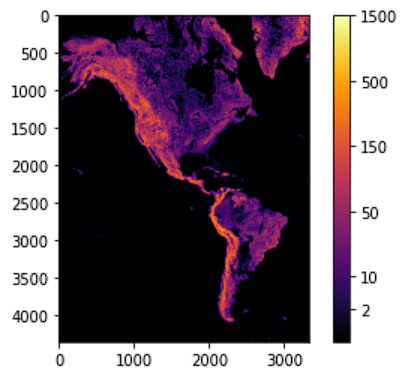

# Gdańsk University of Technology project ASEiED

## Contributors
- Jakub Koniuszewski
- Michał Meyer

## Description of the problem (Task 3)
Analyze the data containing information on the differentiation of the height of the terrain
by selecting the groups of areas with the highest growth (the continent of North and South America). 
The height increase at a given location should be measured with at least 10 measurement points.
Find 6 groups of areas relative to the average value of the height increase. Please put the detected areas on the map.

## Technologies
Purpose of the project was to learn about processing and analyzing vast amounts of data using cloud technologies. 
We have used Amazon EMR (Elastic MapReduce) which is a cloud big data platform for running large-scale distributed
data processing jobs. EMR features include easy provisioning, managed scaling, and reconfiguring of computing clusters.
Regarding additional technologies beside EMR (EMR 5.36.0), we have defined software configuration requirements (Hadoop 2.10.1, JupyterEnterpriseGateway 2.1.0, Spark 2.4.8, Livy 0.7.1) while provisioning the cluster.

## Terrain data
From Amazon Simple Storage Service (Amazon S3) we can download a global dataset providing bare-earth terrain heights.
The data is split to tiles with different zoom values and is available in different formats. We have decided to use the 
**terrarium** format. The data tiles are downloaded using the following endpoint:
```https://s3.amazonaws.com/elevation-tiles-prod/terrarium/{z}/{x}/{y}.png``` and contain raw elevation data
in meters. All values are positive with a 32,768 offset, split into the red, green, and blue channels, 
with 16 bits of integer and 8 bits of fraction. In order to decode elevation value we use the formula:
```(red_channel_value * 256 + green_channel_value + blue_channel_value / 256) - 32768```

## Links
- Terrain Tiles: https://registry.opendata.aws/terrain-tiles/
- Terrain Tile Documentation: https://github.com/tilezen/joerd/tree/master/docs

## Steps taken
In order to calculate the height increase at given locations we have used the the numpy.gradient method which 
computes the gradients given data points.

We have prepared solution approaches with a Spark 2.4.8, as well as default Python.
The result image of the detected areas with 6 groups of specific height increase below:
<br/>
<p align="center">
<br/>
<p align="center">
<br/>
We have conducted some performance measurements for this task using Amazon EMR using 
different cluster configurations by executing Jupyter notebook [code](ASEIED_PYSPARK.ipynb) with PySpark kernel.
The results can bee seen on charts below.
<br/>
<p align="center"><br/>
<p align="center"><br/>
<p align="center"><br/>

The processing time was calculated from the moment of defining the pyspark dataframe with images to the moment
of merging the elevation tiles into complete map with detected areas.
The time results were an average from several measurements. 
The PySpark code was run on Google Colab and the result was about **170 seconds** for tile zoom value 5.

As for the Python approach that doesn't involve putting images into dataframe,
we have executed Jupyter notebook [code](ASEIED_PURE_PYTHON.ipynb) with Python 3 kernel and the average time result for calculations for tile zoom 
value 5 with m5.xlarge instance was around **28 seconds**, also we executed same code on Google Colab and the result
was around **32 seconds**.

Higher zoom values represent increased precision of measurements and more detailed map. 
When describing Task nodes we can say that they can be used to add power to perform parallel computation tasks on data.
Only one instance type was allocated for all the nodes in specific cluster configuration.
Specification for each instance: 

| Instance Name | vCPUs | RAM    | CPU series |
|---------------|:-----:|--------|------------|
| m5.xlarge     |   4   | 16 GiB | Intel® Xeon® Platinum 8175M  |
| m5.2xlarge    |   8   | 32 GiB | Intel® Xeon® Platinum 8175M  |
vCPU (virtual CPU) represents a portion or share of a physical CPU that is assigned to a virtual machine (VM).

## Summary

